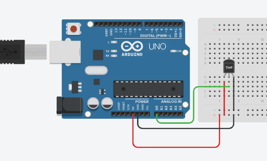
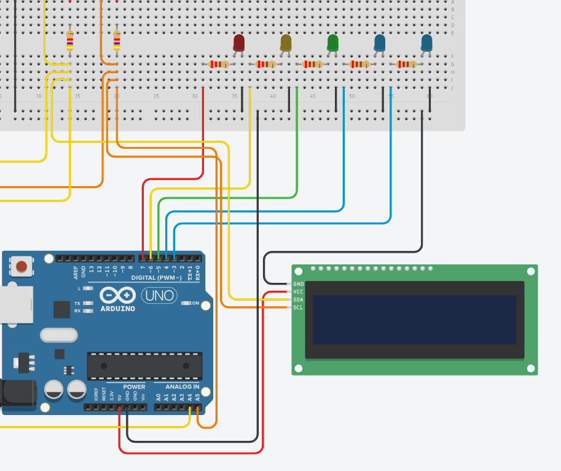
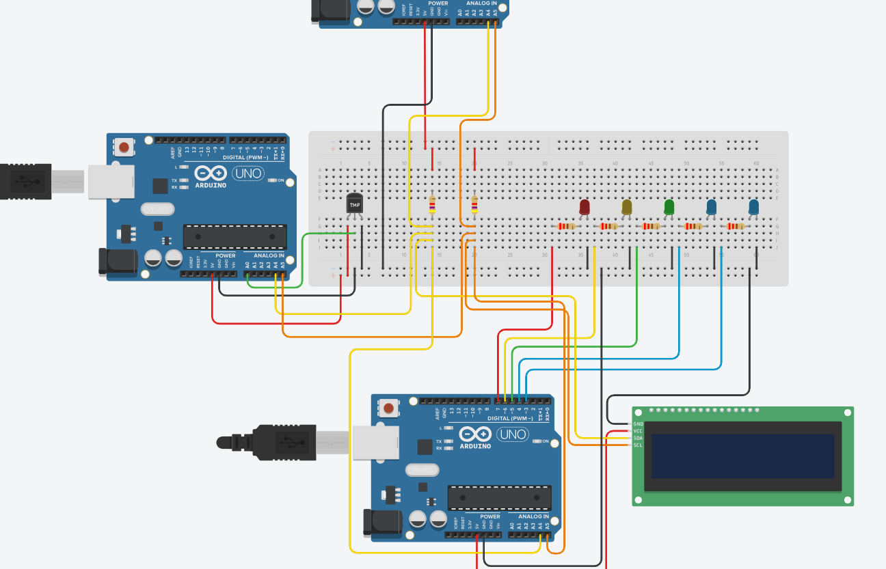
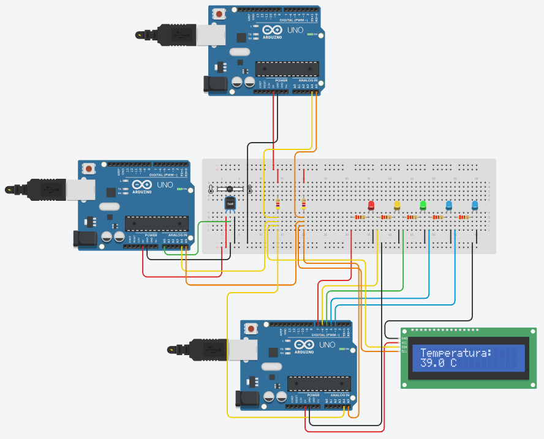

# Tutorial: Sistema de Monitoreo de Temperatura con I2C en Tinkercad


---

## Introducción

En este tutorial implementarás un sistema de monitoreo de temperatura usando el protocolo de comunicación **I2C** con tres Arduino UNO. El sistema funciona de la siguiente manera:

- **Master:** Lee la temperatura del Slave 1 cada 5 segundos y la distribuye.
- **Slave 1:** Tiene un sensor de temperatura TMP36 y responde al Master cuando se le solicita el dato.
- **Slave 2:** Recibe la temperatura del Master, la muestra en una pantalla LCD y enciende LEDs según el rango de temperatura.

### ¿Por qué I2C?

I2C (Inter-Integrated Circuit) es un protocolo de comunicación serial que permite conectar múltiples dispositivos usando solo **dos cables**: SDA (datos) y SCL (reloj). Cada dispositivo tiene una dirección única que el Master usa para identificarlo en el bus.

---

## Materiales (en Tinkercad)

| Componente | Cantidad | Notas |
|-----------|----------|-------|
| Arduino UNO | 3 | Master, Slave 1 y Slave 2 |
| Sensor de temperatura TMP36 | 1 | Para el Slave 1 |
| Pantalla LCD 16x2 con I2C (LiquidCrystal I2C) | 1 | Para el Slave 2 |
| LEDs (azul × 2, verde × 1, amarillo × 1, rojo × 1) | 5 | Para el Slave 2 |
| Resistencias 220Ω | 5 | Una por LED |
| Resistencias 4.7kΩ | 2 | Pull-up para el bus I2C |
| Protoboard | 1 | Para las conexiones |
| Cables de conexión | Varios | |

---

## Arquitectura del sistema

```
                    ┌─────────────┐
          ┌─────────┤   MASTER    ├─────────┐
          │         │ Arduino UNO │         │
          │         └─────────────┘         │
         I2C (0x08)                    I2C (0x09)
    ┌─────┴──────┐                  ┌──────┴──────┐
    │  SLAVE 1   │                  │   SLAVE 2   │
    │ Arduino UNO│                  │ Arduino UNO │
    │   TMP36    │                  │  LCD + LEDs │
    └────────────┘                  └─────────────┘
```

El **Master** es el cerebro del sistema: solicita datos al Slave 1 y los distribuye al Slave 2. Los Slaves solo responden cuando el Master se los pide (Slave 1) o reciben datos (Slave 2).

---

## Parte 1: Conexiones del Slave 1 (Sensor TMP36)

### ¿Cómo funciona el TMP36?

El TMP36 es un sensor de temperatura **analógico**, a diferencia del DHT11 que es digital. Entrega un voltaje de salida proporcional a la temperatura. La conversión se hace con esta fórmula:

```
Temperatura (°C) = (Voltaje_mV - 500) / 10
```

El Arduino lee ese voltaje con su conversor analógico-digital (ADC) en el pin A0 y lo convierte a grados Celsius por software.

### Diagrama de conexión

```
Arduino UNO (Slave 1)
┌──────────────────────────────────────┐
│                                      │
│  TMP36 (visto de frente, texto al    │
│  frente, pines hacia abajo)          │
│                                      │
│  5V  ──────────────→  Pin 1 (VCC)    │
│  A0  ──────────────→  Pin 2 (VOUT)   │
│  GND ──────────────→  Pin 3 (GND)    │
│                                      │
│  A4 (SDA) ─────────→  Bus SDA        │
│  A5 (SCL) ─────────→  Bus SCL        │
│  GND ──────────────→  Bus GND        │
└──────────────────────────────────────┘
```

### Paso a paso

1. Colocá el **Arduino UNO** (Slave 1) en el área de trabajo de Tinkercad.
2. Buscá el componente **"Temperature Sensor [TMP36]"** en la biblioteca de Tinkercad.
3. Conectá el **TMP36** (visto de frente con el texto legible, pines hacia abajo):
   - Pin izquierdo (**VCC**) → Pin **5V** del Arduino
   - Pin central (**VOUT**) → Pin **A0** del Arduino
   - Pin derecho (**GND**) → Pin **GND** del Arduino
4. Los pines **A4** y **A5** serán usados para el bus I2C (se conectarán al Master más adelante).

> ⚠️ **Nota:** El TMP36 tiene 3 pines. Es importante no invertir VCC y GND ya que el sensor se dañaría. Verificá siempre la orientación viendo el componente de frente en Tinkercad.

---

Luego de realizar estas conexiones, el diseño se tendría que verse muy similar a este:


## Parte 2: Conexiones del Slave 2 (LCD + LEDs)

### Diagrama de conexión

```
Arduino UNO (Slave 2)
┌──────────────────────────────────────────┐
│                                          │
│  LCD I2C (módulo PCF8574)                │
│  5V  ──────────────→  VCC LCD            │
│  GND ──────────────→  GND LCD            │
│  A4  ──────────────→  SDA LCD            │
│  A5  ──────────────→  SCL LCD            │
│                                          │
│  LEDs (con resistencia 220Ω en serie)    │
│  D3  ──→ [220Ω] ──→ LED 1 (Azul)  → GND │
│  D4  ──→ [220Ω] ──→ LED 2 (Azul)  → GND │
│  D5  ──→ [220Ω] ──→ LED 3 (Verde) → GND │
│  D6  ──→ [220Ω] ──→ LED 4 (Amarillo)→GND│
│  D7  ──→ [220Ω] ──→ LED 5 (Rojo)  → GND │
│                                          │
│  A4 (SDA) ──────────→  Bus SDA           │
│  A5 (SCL) ──────────→  Bus SCL           │
│  GND ───────────────→  Bus GND           │
└──────────────────────────────────────────┘
```

### Paso a paso

1. Colocá el **Arduino UNO** (Slave 2) en el área de trabajo.
2. Conectá la **LCD I2C**:
   - Pin **VCC** de la LCD → Pin **5V** del Arduino
   - Pin **GND** de la LCD → Pin **GND** del Arduino
   - Pin **SDA** de la LCD → Pin **A4** del Arduino
   - Pin **SCL** de la LCD → Pin **A5** del Arduino
3. Colocá los **5 LEDs** en la protoboard en orden: Azul, Azul, Verde, Amarillo, Rojo.
4. Para cada LED:
   - Conectá una **resistencia de 220Ω** entre el pin digital del Arduino y el ánodo (+) del LED.
   - Conectá el cátodo (−) del LED a **GND**.
   - Los pines digitales son: D3, D4, D5, D6 y D7 respectivamente.

**Importante:** Revisá que en la LCD diga "PCF8574-based" en "type".

> ⚠️ **Nota:** La LCD y el bus I2C comparten los pines A4 y A5, esto es correcto ya que cada dispositivo tiene su propia dirección I2C y conviven en el mismo bus sin conflicto.

---

Las conexiones del slave 2 no necesariamente tienen que verse exactamente de esta manera, pero sí de una forma similar a la que se muestra a continuación:


## Parte 3: Conexiones del Master y el Bus I2C

### Diagrama completo del bus

```
         MASTER                SLAVE 1             SLAVE 2
      Arduino UNO           Arduino UNO          Arduino UNO
          │                     │                    │
5V ──┬───────────────────────────────────────────────
     4.7kΩ
     ├── SDA ─────────────── A4 ──────────────────── A4
     4.7kΩ  
     └── SCL ─────────────── A5 ──────────────────── A5

GND ─────────────────────── GND ─────────────────── GND
```

### Paso a paso

1. Colocá el **Arduino UNO** (Master) en el área de trabajo.
2. Usá la **protoboard** para crear el bus I2C:
   - Conectá una fila de la protoboard como **línea SDA** y otra como **línea SCL**.
3. Conectá las **resistencias pull-up** (4.7kΩ):
   - **5V del Master** → resistencia 4.7kΩ → **línea SDA**
   - **5V del Master** → resistencia 4.7kΩ → **línea SCL**
4. Conectá el **Master** al bus:
   - Pin **A4** del Master → línea SDA
   - Pin **A5** del Master → línea SCL
   - Pin **GND** del Master → línea GND común
5. Conectá el **Slave 1** al bus:
   - Pin **A4** del Slave 1 → línea SDA
   - Pin **A5** del Slave 1 → línea SCL
   - Pin **GND** del Slave 1 → línea GND común
6. Conectá el **Slave 2** al bus:
   - Pin **A4** del Slave 2 → línea SDA
   - Pin **A5** del Slave 2 → línea SCL
   - Pin **GND** del Slave 2 → línea GND común

> ⚠️ **Importante:** El GND común entre todos los Arduinos es obligatorio. Sin él, el bus I2C no funciona porque los dispositivos no tienen una referencia de voltaje compartida.

> 💡 **¿Por qué las resistencias pull-up?** Las líneas I2C necesitan ser "jaladas" hacia un voltaje alto (5V) cuando el bus está inactivo. Las resistencias de 4.7kΩ hacen esto. Sin ellas, las líneas quedan flotantes y la comunicación falla.

---
Las conexiones del master no tienen por qué ser exactamente iguales a las del ejemplo, aunque se recomienda que sigan una estructura parecida. Si te guíaste con las imágenes, el sistema final debería de verse de la siguiente manera:


## Parte 4: Código del Slave 1

Copiá y pegá este código en el Arduino UNO que corresponde al **Slave 1**.

```cpp
#include <Wire.h>

// ── Configuración ──────────────────────────────────────
#define SLAVE_ADDRESS 0x08   // Dirección I2C de este slave
#define TMP36_PIN     A0     // Pin analógico del TMP36

// ── Variables globales ─────────────────────────────────
float temperatura = 0.0;
unsigned long ultimaLectura = 0;
const unsigned long INTERVALO = 5000; // 5 segundos

// ── Setup ──────────────────────────────────────────────
void setup() {
  Serial.begin(9600);

  Wire.begin(SLAVE_ADDRESS);         // Inicia I2C como Slave
  Wire.onRequest(enviarTemperatura); // Callback cuando Master pide dato

  Serial.println("Slave 1 listo");
}

// ── Loop ───────────────────────────────────────────────
void loop() {
  unsigned long ahora = millis();

  if (ahora - ultimaLectura >= INTERVALO) {
    ultimaLectura = ahora;

    // Leemos el valor analógico (0-1023) y lo convertimos a voltaje
    int lecturaCruda = analogRead(TMP36_PIN);
    float voltaje = lecturaCruda * (5.0 / 1023.0); // Convertir a voltios
    float lectura = (voltaje * 1000 - 500) / 10.0; // Convertir a °C

    temperatura = lectura;
    Serial.print("Temperatura: ");
    Serial.print(temperatura);
    Serial.println(" °C");
  }
}

// ── Callback I2C ───────────────────────────────────────
void enviarTemperatura() {
  // Convertimos el float a 4 bytes y los enviamos
  byte datos[4];
  memcpy(datos, &temperatura, 4);
  Wire.write(datos, 4);
}
```

### Explicación del código

- **`Wire.begin(SLAVE_ADDRESS)`:** Inicia el Arduino como dispositivo I2C con la dirección `0x08`. Esta dirección es como el "número de casa" del Slave 1 en el bus.
- **`Wire.onRequest(enviarTemperatura)`:** Registra una función que se ejecuta automáticamente cuando el Master solicita datos a este Slave.
- **`analogRead(TMP36_PIN)`:** Lee el voltaje de salida del TMP36 como un valor entre 0 y 1023.
- **Conversión a °C:** Primero se convierte el valor crudo a voltios (`* 5.0 / 1023.0`), luego se aplica la fórmula del TMP36 (`voltaje_mV - 500) / 10`) para obtener grados Celsius.
- **`memcpy(datos, &temperatura, 4)`:** Convierte el valor `float` (4 bytes) a un arreglo de bytes para poder enviarlo por I2C, que solo transporta bytes.

---

## Parte 5: Código del Slave 2

Copiá y pegá este código en el Arduino UNO que corresponde al **Slave 2**.

```cpp
#include <Wire.h>
#include <LiquidCrystal_I2C.h>

// ── Configuración ──────────────────────────────────────
#define SLAVE_ADDRESS 0x09

// Pines de los LEDs
const int LEDS[] = {3, 4, 5, 6, 7};
const int NUM_LEDS = 5;

// Umbrales de temperatura (°C)
const float UMBRALES[] = {15.0, 20.0, 25.0, 30.0};

// LCD en dirección 0x20, 16 columnas, 2 filas
LiquidCrystal_I2C lcd(0x20, 16, 2);

// ── Variables globales ─────────────────────────────────
float temperatura = 0.0;
bool datoNuevo = false;

// ── Setup ──────────────────────────────────────────────
void setup() {
  Serial.begin(9600);

  // Iniciar I2C como Slave PRIMERO
  Wire.begin(SLAVE_ADDRESS);
  Wire.onReceive(recibirTemperatura); // Callback cuando Master envía dato

  // Iniciar LEDs
  for (int i = 0; i < NUM_LEDS; i++) {
    pinMode(LEDS[i], OUTPUT);
    digitalWrite(LEDS[i], LOW);
  }

  // Iniciar LCD
  lcd.init();
  lcd.backlight();
  lcd.setCursor(0, 0);
  lcd.print("Esperando...");

  Serial.println("Slave 2 listo");
}

// ── Loop ───────────────────────────────────────────────
void loop() {
  if (datoNuevo) {
    datoNuevo = false;
    actualizarLCD();
    actualizarLEDs();
  }
}

// ── Callback I2C ───────────────────────────────────────
void recibirTemperatura(int bytes) {
  if (bytes == 4) {
    byte datos[4];
    for (int i = 0; i < 4; i++) {
      datos[i] = Wire.read();
    }
    memcpy(&temperatura, datos, 4); // Reconstruimos el float
    datoNuevo = true;
  }
}

// ── Actualizar LCD ─────────────────────────────────────
void actualizarLCD() {
  lcd.clear();
  lcd.setCursor(0, 0);
  lcd.print("Temperatura:");
  lcd.setCursor(0, 1);
  lcd.print(temperatura, 1); // 1 decimal
  lcd.print(" C");

  Serial.print("LCD actualizada: ");
  Serial.println(temperatura);
}

// ── Actualizar LEDs ────────────────────────────────────
void actualizarLEDs() {
  // Determinamos cuántos LEDs encender
  int ledsEncendidos = 1; // Siempre al menos uno

  for (int i = 0; i < NUM_LEDS - 1; i++) {
    if (temperatura >= UMBRALES[i]) {
      ledsEncendidos = i + 2;
    }
  }

  // Encendemos/apagamos según corresponda
  for (int i = 0; i < NUM_LEDS; i++) {
    digitalWrite(LEDS[i], i < ledsEncendidos ? HIGH : LOW);
  }

  Serial.print("LEDs encendidos: ");
  Serial.println(ledsEncendidos);
}
```

### Explicación del código

- **`Wire.begin(SLAVE_ADDRESS)`:** Inicia el Arduino como Slave con dirección `0x09`.
- **`Wire.onReceive(recibirTemperatura)`:** Registra una función que se ejecuta cuando el Master envía datos a este Slave.
- **`datoNuevo`:** Es una bandera (flag) que evita actualizar la LCD dentro del callback I2C, ya que hacerlo puede causar problemas de timing. El `loop()` se encarga de procesar el dato cuando es seguro.
- **Lógica de LEDs acumulativa:** Los LEDs se encienden de forma progresiva. Si la temperatura es 27°C, se encienden los primeros 4 LEDs (azul, azul, verde, amarillo), dando una sensación de "barra de progreso".

### Tabla de rangos de LEDs

| LED | Color | Rango |
|-----|-------|-------|
| 1 | Azul | Siempre encendido (T < 15°C) |
| 2 | Azul | T ≥ 15°C |
| 3 | Verde | T ≥ 20°C |
| 4 | Amarillo | T ≥ 25°C |
| 5 | Rojo | T ≥ 30°C |

---

## Parte 6: Código del Master

Copiá y pegá este código en el Arduino UNO que corresponde al **Master**.

```cpp
#include <Wire.h>

// ── Configuración ──────────────────────────────────────
#define SLAVE1_ADDRESS 0x08  // Sensor TMP36
#define SLAVE2_ADDRESS 0x09  // LCD + LEDs

const unsigned long INTERVALO = 5000; // 5 segundos

// ── Variables globales ─────────────────────────────────
unsigned long ultimaLectura = 0;
float temperatura = 0.0;

// ── Setup ──────────────────────────────────────────────
void setup() {
  Serial.begin(9600);
  Wire.begin(); // Inicia I2C como Master (sin dirección)

  Serial.println("Master listo");
}

// ── Loop ───────────────────────────────────────────────
void loop() {
  unsigned long ahora = millis();

  if (ahora - ultimaLectura >= INTERVALO) {
    ultimaLectura = ahora;

    if (leerTemperatura()) {
      enviarASlave2();
    }
  }
}

// ── Leer temperatura del Slave 1 ───────────────────────
bool leerTemperatura() {
  Wire.requestFrom(SLAVE1_ADDRESS, 4); // Pedimos 4 bytes

  if (Wire.available() == 4) {
    byte datos[4];
    for (int i = 0; i < 4; i++) {
      datos[i] = Wire.read();
    }
    memcpy(&temperatura, datos, 4); // Reconstruimos el float

    Serial.print("[Master] Temperatura recibida: ");
    Serial.print(temperatura);
    Serial.println(" °C");
    return true;
  }

  Serial.println("[Master] Error: Slave 1 no respondió");
  return false;
}

// ── Enviar temperatura al Slave 2 ──────────────────────
void enviarASlave2() {
  byte datos[4];
  memcpy(datos, &temperatura, 4); // Convertimos float a bytes

  Wire.beginTransmission(SLAVE2_ADDRESS);
  Wire.write(datos, 4);
  byte error = Wire.endTransmission();

  if (error == 0) {
    Serial.println("[Master] Dato enviado al Slave 2 OK");
  } else {
    Serial.print("[Master] Error enviando a Slave 2, código: ");
    Serial.println(error);
  }
}
```

### Explicación del código

- **`Wire.begin()`:** El Master no necesita dirección propia, solo los Slaves la necesitan.
- **`Wire.requestFrom(SLAVE1_ADDRESS, 4)`:** Le dice al Slave 1 que envíe 4 bytes. Esto dispara el callback `onRequest` en el Slave 1.
- **`Wire.beginTransmission()` / `Wire.endTransmission()`:** Inicia y finaliza el envío de datos al Slave 2.
- **`endTransmission()` retorna un código de error:** 0 significa éxito, cualquier otro valor indica un problema en la comunicación.

---

## Parte 7: Verificación del sistema

Una vez cargados los tres códigos, verificá el funcionamiento en este orden:

### 1. Verificar el Slave 1
Abrí el monitor serial del Slave 1. Deberías ver:
```
Slave 1 listo
Temperatura: 25.10 °C
Temperatura: 25.10 °C
```

### 2. Verificar el Master
Abrí el monitor serial del Master. Deberías ver:
```
Master listo
[Master] Temperatura recibida: 24 °C
[Master] Dato enviado al Slave 2 OK
```

### 3. Verificar el Slave 2
- La LCD debería mostrar `Temperatura: 24.0 C`
- Los LEDs deberían encenderse según el rango de temperatura

Puedes seleccionar diferentes valores de temperatura para verificar el funcionamiento del sistema. Para esto dale click al sensor de temperatura y debería de aparecer una barra arriba de este con la que se puede variar la temperatura. A continuación se presentan los tres casos probados:





### Tabla de diagnóstico de errores

| Síntoma | Causa probable | Solución |
|---------|---------------|----------|
| "Error: Slave 1 no respondió" | GND no compartido o cables SDA/SCL mal conectados | Verificar cableado del bus |
| LCD no enciende | Dirección I2C incorrecta | Cambiar `0x27` por `0x3F` |
| LCD muestra símbolos extraños | Dirección I2C incorrecta | Cambiar `0x27` por `0x3F` |
| LEDs no encienden | Pin incorrecto o resistencia mal conectada | Verificar pines D3-D7 y resistencias |
| Nada funciona | GND no compartido entre Arduinos | Conectar todos los GND entre sí |

---

## Resumen de direcciones I2C

| Dispositivo | Dirección |
|------------|-----------|
| Slave 1 (TMP36) | 0x08 |
| Slave 2 (LCD + LEDs) | 0x09 |
| LCD (módulo PCF8574) | 0x27 o 0x3F |

---

